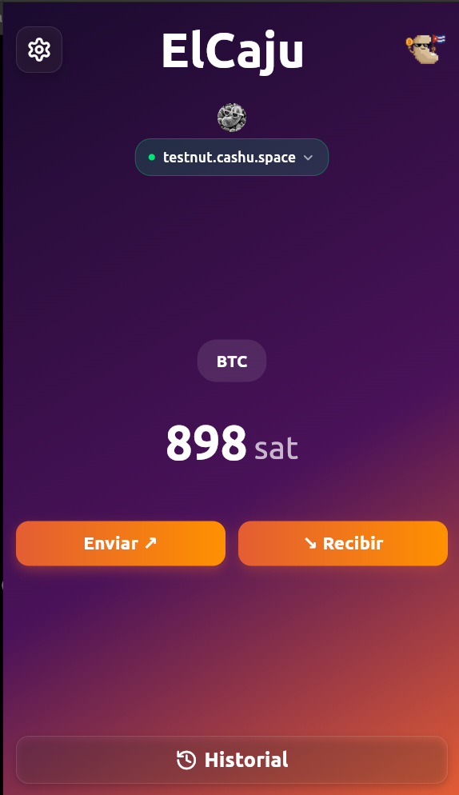
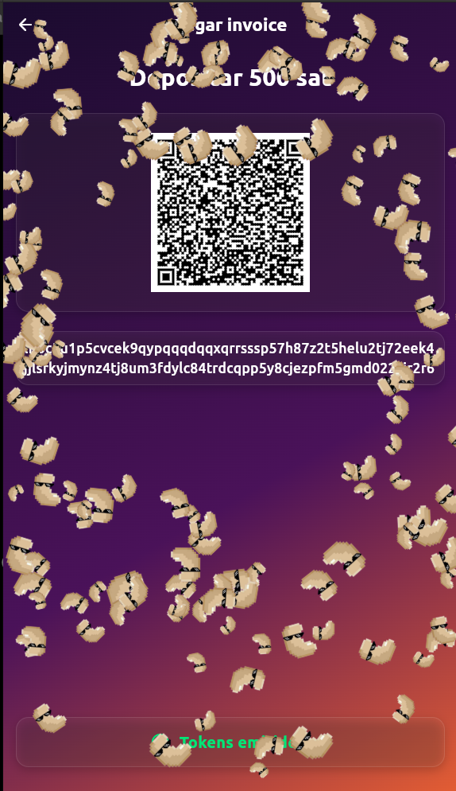
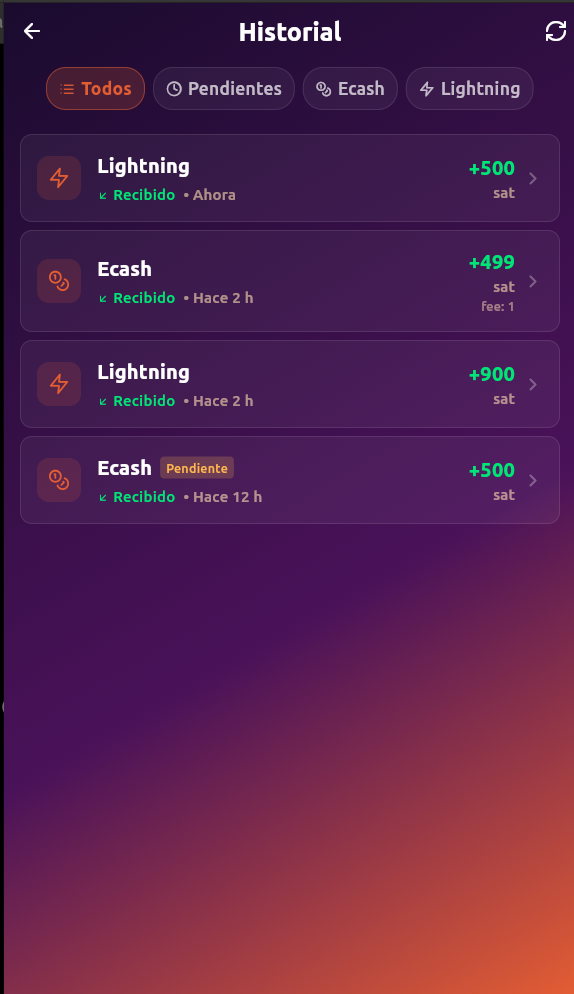
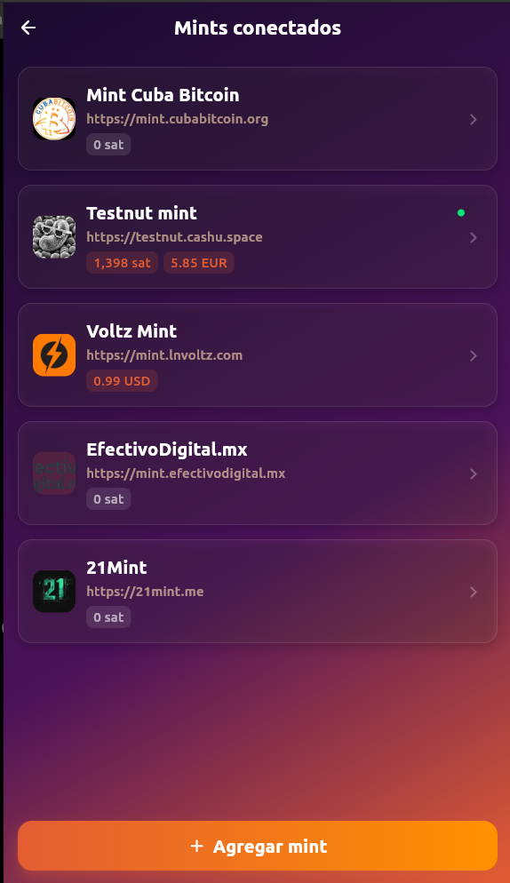
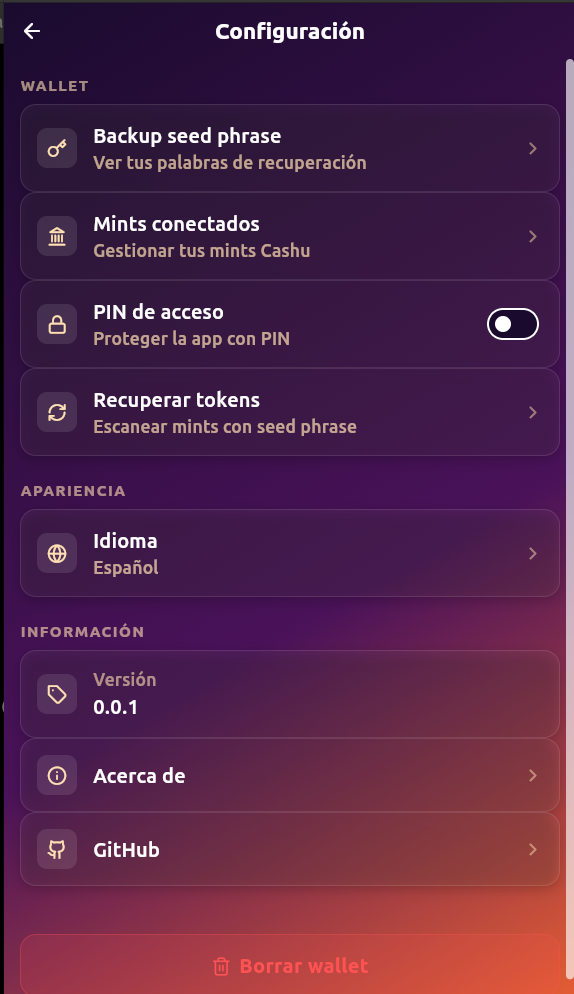

# ElCaju 🥜

<p align="center">
  
</p>

<p align="center">
  <strong>Your private ecash wallet on Bitcoin</strong>
</p>

<p align="center">
  
  
  
  
  
</p>

<p align="center">
  <a href="https://elcaju.me">elcaju.me</a> •
  <a href="#-installation">Installation</a> •
  <a href="#-features">Features</a> •
  <a href="#-technologies">Technologies</a>
</p>

---

## 📱 About ElCaju

**ElCaju** is a [Cashu](https://cashu.space) wallet (ecash on Bitcoin) with Cuban identity, brother of [LaChispa](https://github.com/lachispame/) (Lightning). Designed to offer privacy, offline transactions, and a warm tropical experience.

### What is Cashu?

Cashu is an ecash protocol that enables Bitcoin transactions with maximum privacy. Cashu tokens are:
- **Private**: Fungible and untraceable
- **Offline**: Store and send tokens without internet connection
- **Instant**: No waiting for blockchain confirmations

---

## ✨ Features

| Feature | Description |
|---------|-------------|
| 🔐 **Total Privacy** | Fungible ecash tokens, no traceable history |
| 📴 **Works Offline** | Store and share tokens without internet |
| ⚡ **Lightning Bridge** | Deposit and withdraw sats via Lightning Network |
| 🏦 **Multi-Mint** | Connect to multiple Cashu mints simultaneously |
| 💱 **Multi-Unit** | Support for sat, USD, EUR and more |
| 🔑 **Your Seed, Your Money** | Backup with 12 words (BIP39) |
| 🔒 **Optional PIN** | Protect access to your wallet |
| 🌐 **Bilingual** | Spanish and English |
| 🎉 **Friendly UX** | Visual effects and confetti when receiving funds |

---

## 🚀 Screenshots

<p align="center">
  
  
  
  
  
</p>

---

## 🔧 Technologies

### Frontend
- **Flutter 3.27+**: Cross-platform framework
- **Dart**: Programming language
- **Provider**: State management
- **QR Flutter**: QR code generation

### Backend & Core
- **[cdk-flutter](https://github.com/cashubtc/cdk_flutter)**: Cashu Development Kit (Rust FFI)
- **SQLite**: Local persistence via cdk-sqlite
- **Flutter Secure Storage**: Secure storage for seed and PIN

### Protocols
- **Cashu**: NUT-00 to NUT-13 (ecash protocol)
- **Lightning Network**: Deposits and withdrawals via BOLT11
- **BIP39**: Seed phrase generation

---

## 📦 Installation

### Prerequisites

- Flutter SDK (>=3.27.0)
- Dart SDK (>=3.6.0)
- Android Studio with Android SDK
- Android NDK 26.3+ (install via Android Studio > SDK Manager > SDK Tools)
- Rust toolchain (>=1.85.0)

### Clone the Repository

```bash
git clone https://github.com/Forte11Cuba/elcaju.git
cd elcaju
```

### Install Dependencies

```bash
flutter pub get
```

### Configure Rust for Android (Linux/macOS)

```bash
# Install Rust if not already installed
curl --proto '=https' --tlsv1.2 -sSf https://sh.rustup.rs | sh

# Update to latest stable (requires >= 1.85.0)
rustup update stable

# Install Android targets
rustup target add aarch64-linux-android   # arm64-v8a (modern devices)
rustup target add armv7-linux-androideabi # armeabi-v7a (older devices)
rustup target add x86_64-linux-android    # x86_64 (emulators)
```

### Configure Android NDK Linkers

Create or edit `~/.cargo/config.toml` with your NDK path:

```toml
[target.x86_64-unknown-linux-gnu]
linker = "gcc"
rustflags = ["-C", "link-arg=-fuse-ld=bfd"]

[target.aarch64-linux-android]
linker = "/path/to/Android/Sdk/ndk/26.3.11579264/toolchains/llvm/prebuilt/linux-x86_64/bin/aarch64-linux-android24-clang"

[target.armv7-linux-androideabi]
linker = "/path/to/Android/Sdk/ndk/26.3.11579264/toolchains/llvm/prebuilt/linux-x86_64/bin/armv7a-linux-androideabi24-clang"

[target.x86_64-linux-android]
linker = "/path/to/Android/Sdk/ndk/26.3.11579264/toolchains/llvm/prebuilt/linux-x86_64/bin/x86_64-linux-android24-clang"

[env]
CC_armv7-linux-androideabi = "/path/to/Android/Sdk/ndk/26.3.11579264/toolchains/llvm/prebuilt/linux-x86_64/bin/armv7a-linux-androideabi24-clang"
AR_armv7-linux-androideabi = "/path/to/Android/Sdk/ndk/26.3.11579264/toolchains/llvm/prebuilt/linux-x86_64/bin/llvm-ar"
CC_x86_64-linux-android = "/path/to/Android/Sdk/ndk/26.3.11579264/toolchains/llvm/prebuilt/linux-x86_64/bin/x86_64-linux-android24-clang"
AR_x86_64-linux-android = "/path/to/Android/Sdk/ndk/26.3.11579264/toolchains/llvm/prebuilt/linux-x86_64/bin/llvm-ar"
CC_aarch64-linux-android = "/path/to/Android/Sdk/ndk/26.3.11579264/toolchains/llvm/prebuilt/linux-x86_64/bin/aarch64-linux-android24-clang"
AR_aarch64-linux-android = "/path/to/Android/Sdk/ndk/26.3.11579264/toolchains/llvm/prebuilt/linux-x86_64/bin/llvm-ar"
```

> **Note**: Replace `/path/to/Android/Sdk` with your actual Android SDK path (usually `~/Android/Sdk` on Linux or `~/Library/Android/sdk` on macOS).

### Compile Native Libraries

The cdk_flutter native libraries must be compiled manually:

```bash
# Navigate to cdk_flutter rust directory
cd ~/.pub-cache/git/cdk_flutter-*/rust

# Build for each architecture
cargo build --release --target aarch64-linux-android
cargo build --release --target armv7-linux-androideabi
cargo build --release --target x86_64-linux-android

# Copy libraries to project
mkdir -p /path/to/elcaju/android/app/src/main/jniLibs/{arm64-v8a,armeabi-v7a,x86_64}

cp target/aarch64-linux-android/release/libcdk_flutter.so \
   /path/to/elcaju/android/app/src/main/jniLibs/arm64-v8a/

cp target/armv7-linux-androideabi/release/libcdk_flutter.so \
   /path/to/elcaju/android/app/src/main/jniLibs/armeabi-v7a/

cp target/x86_64-linux-android/release/libcdk_flutter.so \
   /path/to/elcaju/android/app/src/main/jniLibs/x86_64/
```

### Run in Development

```bash
flutter run
```

### Build for Production

```bash
# Android APK (includes all architectures, ~55MB)
flutter build apk --release

# Android App Bundle (recommended for Play Store)
flutter build appbundle --release
```

### Quick Build (arm64 only)

For faster builds targeting only modern devices:

```bash
# Build only arm64 library
cargo build --release --target aarch64-linux-android

# Copy to project
cp target/aarch64-linux-android/release/libcdk_flutter.so \
   android/app/src/main/jniLibs/arm64-v8a/

# Build APK (~40MB)
flutter build apk --release
```

---

## 🏗️ Architecture

```
┌─────────────────────────────────────────┐
│          Flutter UI (Dart)              │
│   Provider + Streams + Intl             │
├─────────────────────────────────────────┤
│     WalletProvider / SettingsProvider   │
│   (Multi-unit: Map<mintUrl:unit>)       │
├─────────────────────────────────────────┤
│          cdk-flutter (FFI)              │
│      flutter_rust_bridge v2.11.1        │
├─────────────────────────────────────────┤
│           Rust Core (CDK)               │
│  Cashu 0.13.4 + SQLite + Bitcoin        │
└─────────────────────────────────────────┘
```

### Project Structure

```
elcaju/
├── lib/
│   ├── main.dart                 # Entry point
│   ├── core/
│   │   ├── constants/            # Colors, dimensions
│   │   ├── theme/                # App theme
│   │   └── utils/                # Formatters, validators
│   ├── providers/
│   │   ├── wallet_provider.dart  # Wallet logic
│   │   └── settings_provider.dart# Preferences and PIN
│   ├── screens/
│   │   ├── 1_splash/             # Loading screen
│   │   ├── 2_onboarding/         # Create/restore wallet
│   │   ├── 3_home/               # Main screen
│   │   ├── 4_receive/            # Receive tokens
│   │   ├── 5_send/               # Send tokens
│   │   ├── 6_mint/               # Deposit via Lightning
│   │   ├── 7_melt/               # Withdraw to Lightning
│   │   └── 8_settings/           # Settings
│   ├── widgets/
│   │   ├── common/               # Buttons, cards, etc.
│   │   └── effects/              # Confetti and animations
│   └── l10n/                     # Translations ES/EN
└── assets/
    └── img/                      # Logo and assets
```

---

## 🔐 Security

| Feature | Implementation |
|---------|----------------|
| **Seed Phrase** | Stored with Flutter Secure Storage (native encryption) |
| **PIN** | Secure hash, local verification |
| **Local Data** | SQLite with proofs encrypted by Cashu protocol |
| **No Tracking** | We don't collect user data |
| **Open Source** | 100% auditable |

### Important

> ⚠️ **Backup your seed phrase (12 words)**. Without it, you won't be able to recover your funds if you lose your device.

---

## 📱 Compatibility

| Platform | Status | Minimum Version |
|----------|--------|-----------------|
| ✅ Android | Supported | API 24 (Android 7.0) |
| 🚧 iOS | Coming soon | iOS 12.0+ |
| 🚧 Web | Coming soon | - |

---

## 🌐 Default Mint

ElCaju comes preconfigured with the Cuba Bitcoin mint:

```
https://mint.cubabitcoin.org
```

You can add other Cashu mints from the settings.

---

## 🤝 Contributing

Contributions are welcome!

1. Fork the repository
2. Create a branch for your feature (`git checkout -b feature/new-feature`)
3. Commit your changes (`git commit -m 'Add new feature'`)
4. Push to the branch (`git push origin feature/new-feature`)
5. Open a Pull Request

### Report Bugs

Open an [issue](https://github.com/Forte11Cuba/elcaju/issues) with:
- Problem description
- Steps to reproduce
- Android version/device
- Relevant logs

---

## 📄 License

This project is under the MIT License - see the [LICENSE](LICENSE) file for more details.

---

## 🙏 Credits

- **[Cashu](https://cashu.space)** - Ecash protocol
- **[cdk-flutter](https://github.com/cashubtc/cdk_flutter)** - Cashu Development Kit
- **[Cashu4Community](https://cashu4community.xyz)** - Global Cashu community
- **[Cuba Bitcoin](https://cubabitcoin.org)** - Cuban Bitcoin community

---

<p align="center">
  <strong>Made with 🧡 by <a href="https://github.com/Forte11Cuba">Forte11</a></strong>
</p>

<p align="center">
  <a href="https://cashu4community.xyz">Cashu4Community</a> •
  <a href="https://cubabitcoin.org">Cuba Bitcoin</a> •
  <a href="https://elcaju.me">elcaju.me</a>
</p>
