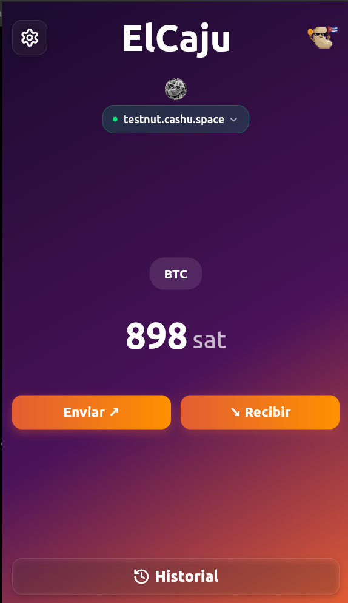
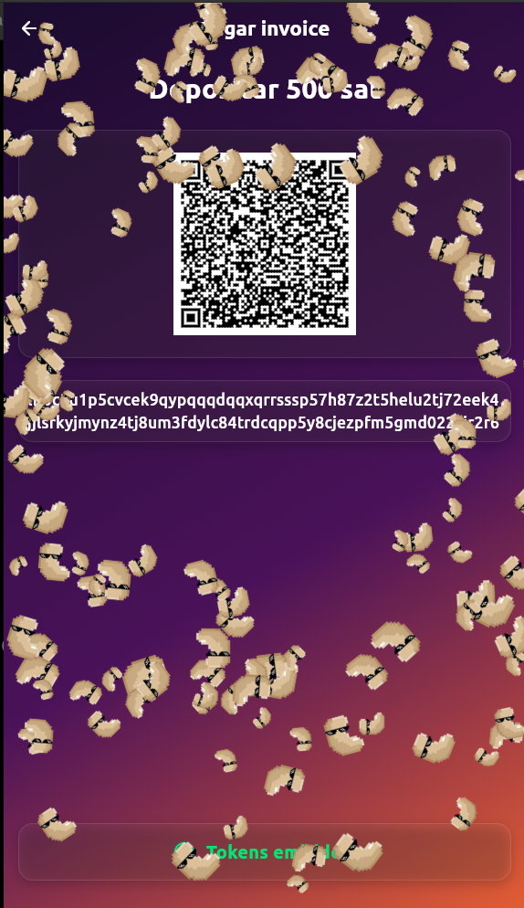
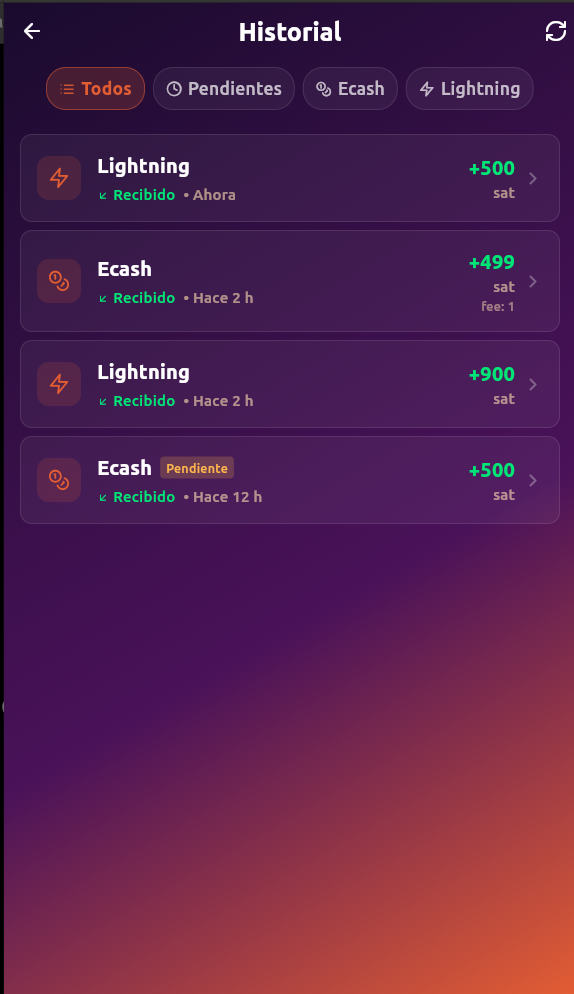
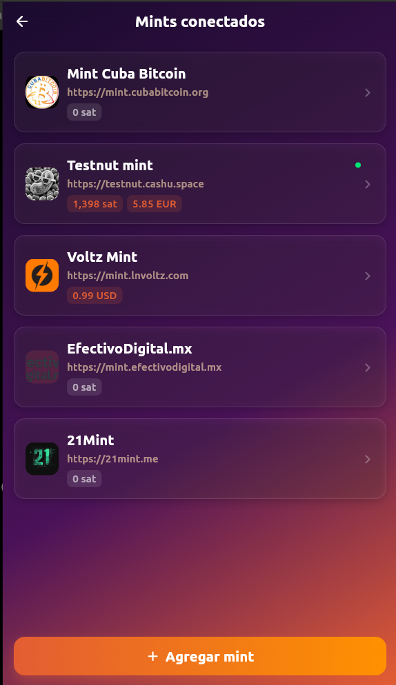
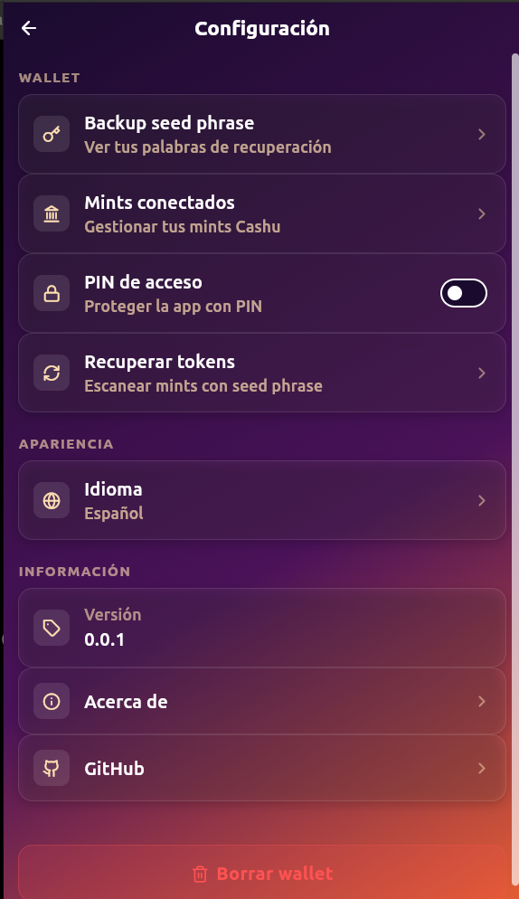

## ElCaju 🥜

[](https://deepwiki.com/Forte11Cuba/elcaju)
  *Ask questions about this project using DeepWiki AI*

<p align="center">
  
</p>

<p align="center">
  <strong>Your private ecash wallet on Bitcoin</strong>
</p>

<p align="center">
  
  
  
  
  
</p>

<p align="center">
  <a href="https://elcaju.me">elcaju.me</a> •
  <a href="#-installation">Installation</a> •
  <a href="#-features">Features</a> •
  <a href="#-technologies">Technologies</a>
</p>

---

## About ElCaju

**ElCaju** is a [Cashu](https://cashu.space) wallet (ecash on Bitcoin) with Cuban identity, brother of [LaChispa](https://github.com/lachispame/) (Lightning). Designed to offer privacy, offline transactions, and a warm tropical experience.

### What is Cashu?

Cashu is an ecash protocol that enables Bitcoin transactions with maximum privacy. Cashu tokens are:
- **Private**: Fungible and untraceable
- **Offline**: Store and send tokens without internet connection
- **Instant**: No waiting for blockchain confirmations

---

## Features

| Feature | Description |
|---------|-------------|
| **Total Privacy** | Fungible ecash tokens, no traceable history |
| **Works Offline** | Store, create, and share tokens without internet |
| **Lightning Bridge** | Deposit and withdraw sats via Lightning Network |
| **Multi-Mint** | Connect to unlimited Cashu mints simultaneously |
| **Multi-Unit** | Support for sat, USD, EUR, and any unit offered by mints |
| **P2PK (NUT-10)** | Lock tokens to a Nostr public key — only the recipient can claim |
| **Token Recovery (NUT-13)** | Restore tokens from any mint using your seed phrase |
| **NFC Transfers** | Share tokens via NFC — includes Host Card Emulation (HCE) |
| **Animated QR** | UR-format multi-frame QR codes for large tokens |
| **Peanut Emoji** | Encode tokens as emoji (compatible with cashu.me) |
| **Transaction History** | Full history with filters: Ecash, Lightning, Pending |
| **Pending Tokens** | Save tokens to claim later (up to 50, 30-day expiry) |
| **BTC Price** | Live price via Yadio API with fiat conversion |
| **Your Seed, Your Money** | Backup with 12 words (BIP39) |
| **Optional PIN** | 4-digit PIN to protect wallet access |
| **11 Languages** | ES, EN, PT, FR, RU, DE, IT, KO, ZH, JA, SW |
| **Friendly UX** | Confetti celebrations when receiving funds |

---

## Screenshots

<p align="center">
  
  
  
  
  
</p>

---

## Technologies

### Frontend
- **Flutter 3.27+**: Cross-platform framework
- **Dart 3.11+**: Programming language
- **Provider**: State management
- **QR Flutter + Mobile Scanner**: QR generation and scanning

### Backend & Core
- **elcaju_core**: Internal Rust library via [flutter_rust_bridge](https://github.com/fzyzcjy/flutter_rust_bridge) v2.11.1 (FFI)
- **[CDK](https://github.com/cashubtc/cdk) 0.15.1**: Cashu Development Kit (wallet, SQLite, HTTP client, signatory)
- **SQLite**: Local persistence via cdk-sqlite
- **Flutter Secure Storage**: Encrypted storage for seed and PIN

### Protocols
- **Cashu**: NUT-00, 04, 05, 06, 07, 09, 10 (P2PK), 13 (restore)
- **Lightning Network**: Deposits and withdrawals via BOLT11
- **BIP39 / BIP32**: Seed phrase generation and key derivation
- **NIP-06**: Nostr key derivation from mnemonic for P2PK

### Native
- **NFC Manager + HCE**: Phone-to-phone token transfers
- **Android NDK 27.0**: Multi-architecture native compilation
- **Cargokit**: Automated Rust build integration

---

## Installation

### Prerequisites

- Flutter SDK (>=3.27.0)
- Dart SDK (>=3.11.0)
- Android Studio with Android SDK
- Android NDK 27.0+ (install via Android Studio > SDK Manager > SDK Tools)
- Rust toolchain (edition 2024; rustc >= 1.85.0)

### Clone the Repository

```bash
git clone https://github.com/Forte11Cuba/elcaju.git
cd elcaju
```

### Install Dependencies

```bash
flutter pub get
```

### Configure Rust for Android (Linux/macOS)

```bash
# Install Rust if not already installed
curl --proto '=https' --tlsv1.2 -sSf https://sh.rustup.rs | sh

# Update to latest stable
rustup update stable

# Install Android targets
rustup target add aarch64-linux-android   # arm64-v8a (modern devices)
rustup target add armv7-linux-androideabi # armeabi-v7a (older devices)
rustup target add x86_64-linux-android    # x86_64 (emulators)
```

### Configure Android NDK Linkers

Create or edit `~/.cargo/config.toml` with your NDK path:

```toml
[target.x86_64-unknown-linux-gnu]
linker = "gcc"
rustflags = ["-C", "link-arg=-fuse-ld=bfd"]

[target.aarch64-linux-android]
linker = "/path/to/Android/Sdk/ndk/27.0.12077973/toolchains/llvm/prebuilt/linux-x86_64/bin/aarch64-linux-android24-clang"

[target.armv7-linux-androideabi]
linker = "/path/to/Android/Sdk/ndk/27.0.12077973/toolchains/llvm/prebuilt/linux-x86_64/bin/armv7a-linux-androideabi24-clang"

[target.x86_64-linux-android]
linker = "/path/to/Android/Sdk/ndk/27.0.12077973/toolchains/llvm/prebuilt/linux-x86_64/bin/x86_64-linux-android24-clang"

[env]
CC_armv7-linux-androideabi = "/path/to/Android/Sdk/ndk/27.0.12077973/toolchains/llvm/prebuilt/linux-x86_64/bin/armv7a-linux-androideabi24-clang"
AR_armv7-linux-androideabi = "/path/to/Android/Sdk/ndk/27.0.12077973/toolchains/llvm/prebuilt/linux-x86_64/bin/llvm-ar"
CC_x86_64-linux-android = "/path/to/Android/Sdk/ndk/27.0.12077973/toolchains/llvm/prebuilt/linux-x86_64/bin/x86_64-linux-android24-clang"
AR_x86_64-linux-android = "/path/to/Android/Sdk/ndk/27.0.12077973/toolchains/llvm/prebuilt/linux-x86_64/bin/llvm-ar"
CC_aarch64-linux-android = "/path/to/Android/Sdk/ndk/27.0.12077973/toolchains/llvm/prebuilt/linux-x86_64/bin/aarch64-linux-android24-clang"
AR_aarch64-linux-android = "/path/to/Android/Sdk/ndk/27.0.12077973/toolchains/llvm/prebuilt/linux-x86_64/bin/llvm-ar"
```

> **Note**: Replace `/path/to/Android/Sdk` with your actual Android SDK path (usually `~/Android/Sdk` on Linux or `~/Library/Android/sdk` on macOS).

### Run in Development

The Rust library compiles automatically via Cargokit during `flutter run`:

```bash
flutter run
```

> **Note**: The first build will take several minutes while Rust compiles. Subsequent builds are incremental.

### Build for Production

```bash
# Android APK (includes all architectures)
flutter build apk --release

# Android App Bundle (recommended for Play Store)
flutter build appbundle --release
```

### Quick Build (arm64 only)

For faster builds targeting only modern devices:

```bash
flutter build apk --release --target-platform android-arm64
```

---

## Architecture

```text
┌─────────────────────────────────────────┐
│          Flutter UI (Dart 3.11+)        │
│   Provider + Streams + Intl (11 langs)  │
├─────────────────────────────────────────┤
│     4 Providers: Wallet, Settings,      │
│       Price (Yadio), P2PK (NIP-06)      │
├─────────────────────────────────────────┤
│    flutter_rust_bridge v2.11.1 (FFI)    │
├─────────────────────────────────────────┤
│        elcaju_core (Rust interno)       │
│   CDK 0.15.1 + SQLite + BIP39 + Tokio  │
└─────────────────────────────────────────┘
```

### Project Structure

```text
elcaju/
├── lib/
│   ├── main.dart                  # Entry point (RustLib.init + Providers)
│   ├── core/
│   │   ├── constants/             # Colors, dimensions
│   │   ├── models/                # Proof model
│   │   ├── services/              # LNURL, NFC, price, proofs
│   │   ├── theme/                 # Material 3 dark theme
│   │   └── utils/                 # Formatters, parsers, nostr, p2pk, peanut codec
│   ├── data/                      # Pending tokens, transaction metadata storage
│   ├── models/                    # P2PK key model (npub/nsec)
│   ├── providers/
│   │   ├── wallet_provider.dart   # Multi-mint, multi-unit wallet logic
│   │   ├── settings_provider.dart # Preferences, PIN, seed
│   │   ├── price_provider.dart    # BTC price cache (Yadio API)
│   │   └── p2pk_provider.dart     # Nostr key management (NIP-06)
│   ├── screens/
│   │   ├── 1_splash/              # Loading & initialization
│   │   ├── 2_onboarding/          # Create / restore / backup seed
│   │   ├── 3_home/                # Main dashboard
│   │   ├── 4_receive/             # Receive tokens (paste, QR, NFC)
│   │   ├── 5_send/                # Send tokens + offline mode + share
│   │   ├── 6_mint/                # Lightning deposit
│   │   ├── 7_melt/                # Lightning withdrawal
│   │   ├── 8_settings/            # Settings, mints, P2PK keys, language
│   │   ├── 9_history/             # Transaction history with filters
│   │   └── 10_scanner/            # QR code scanner
│   ├── src/rust/                  # FFI bridge (auto-generated + API bindings)
│   ├── widgets/
│   │   ├── common/                # Buttons, cards, numpad, backgrounds
│   │   ├── effects/               # Confetti animation
│   │   ├── proof/                 # Proof selector (offline send)
│   │   └── scanner/               # QR scanner widget
│   └── l10n/                      # 11 languages (354 translation keys)
├── rust/
│   ├── Cargo.toml                 # elcaju_core: CDK 0.15.1, flutter_rust_bridge 2.11.1
│   └── src/api/                   # wallet, token, keys, mint_info, error
├── rust_builder/                  # Cargokit integration (auto Rust compilation)
├── android/                       # Android config (NDK 27.0, NFC HCE service)
└── assets/img/                    # Logo and screenshots
```

---

## Cashu NUT Support

| NUT | Name | Status |
|-----|------|--------|
| NUT-00 | Cashu Protocol | Supported |
| NUT-04 | Mint (Lightning deposit) | Supported |
| NUT-05 | Melt (Lightning withdrawal) | Supported |
| NUT-06 | Token swap | Supported |
| NUT-07 | Spend conditions (witness) | Supported |
| NUT-09 | Token restore | Supported |
| NUT-10 | P2PK (locked tokens) | Supported |
| NUT-13 | Deterministic secrets (recovery) | Supported |

---

## Security

| Feature | Implementation |
|---------|----------------|
| **Seed Phrase** | BIP39 12 words, stored with Flutter Secure Storage (native encryption) |
| **Key Derivation** | BIP32 + NIP-06 (m/44'/1237'/0'/0/0) for P2PK keys |
| **PIN** | 4-digit PIN with secure hash, local verification |
| **Local Data** | SQLite with proofs managed by CDK |
| **P2PK Keys** | Primary (from seed) + up to 10 imported keys, all encrypted |
| **No Tracking** | We don't collect user data |
| **Open Source** | 100% auditable |

### Important

> **Backup your seed phrase (12 words)**. Without it, you won't be able to recover your funds if you lose your device.

---

## Compatibility

| Platform | Status | Minimum Version |
|----------|--------|-----------------|
| Android | Supported | API 24 (Android 7.0) |
| iOS | Coming soon | iOS 11.0+ |
| Web | Coming soon | - |

---

## Default Mint

ElCaju comes preconfigured with the Cuba Bitcoin mint:

```text
https://mint.cubabitcoin.org
```

You can add other Cashu mints from the settings.

---

## CI/CD

Automated releases via GitHub Actions (`.github/workflows/release.yml`):
- Triggers on git tags (`v*`)
- Builds multi-architecture APKs (arm64, armv7, x86_64) + universal APK
- Creates GitHub releases automatically

---

## Contributing

Contributions are welcome!

1. Fork the repository
2. Create a branch for your feature (`git checkout -b feature/new-feature`)
3. Commit your changes (`git commit -m 'Add new feature'`)
4. Push to the branch (`git push origin feature/new-feature`)
5. Open a Pull Request

### Report Bugs

Open an [issue](https://github.com/Forte11Cuba/elcaju/issues) with:
- Problem description
- Steps to reproduce
- Android version/device
- Relevant logs

---

## License

This project is under the MIT License - see the [LICENSE](LICENSE) file for more details.

---

## Credits

- **[Cashu](https://cashu.space)** - Ecash protocol
- **[CDK](https://github.com/cashubtc/cdk)** - Cashu Development Kit
- **[flutter_rust_bridge](https://github.com/fzyzcjy/flutter_rust_bridge)** - Rust-Dart FFI
- **[Cashu4Community](https://cashu4community.xyz)** - Global Cashu community
- **[Cuba Bitcoin](https://cubabitcoin.org)** - Cuban Bitcoin community

---

<p align="center">
  <strong>Made with 🧡 by <a href="https://github.com/Forte11Cuba">Forte11</a></strong>
</p>

<p align="center">
  <a href="https://cashu4community.xyz">Cashu4Community</a> •
  <a href="https://cubabitcoin.org">Cuba Bitcoin</a> •
  <a href="https://elcaju.me">elcaju.me</a>
</p>
